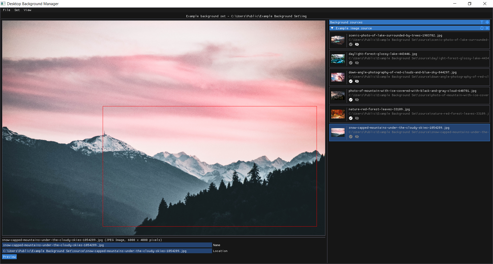

# dbgm
`dbgm` is a tool for managing a library of Windows desktop backgrounds. It is currently in alpha status, and only the core functionality is implemented. It supports the ability to import backgrounds from folders on-disk and nondestructively edit these backgrounds to best fit a particular screen resolution. The edited versions are then saved to a folder from which Windows can generate a slideshow.

## Installation
At the present, the only way to install `dbgm` is to build it locally. The steps to do so are as follows:

1. `dbgm` is written in Rust, and requires a Rust toolchain to build. If Rust is not already present on your system, you can install it by following the instructions [here](https://www.rust-lang.org/tools/install).

2. Once Rust is installed, clone this repository:

    ```
    git clone https://github.com/CCS-1L-F19/dbgm.git
    cd dbgm
    ```

3. Then, to build, execute the command `cargo build`. To run the application, execute `cargo run`. 

In the future, DBGM will be distributed in binary form from this repository's Releases page.

## Development Status
Currently, `dbgm` is in alpha. This means that while the core functionality is present, there are many rough edges and missing features, and in particular the UI is subject to change. Progress is tracked on the [kanban board](https://github.com/CCS-1L-F19/dbgm/projects/1), and some design goals can be found in [DESIGN.md](https://github.com/CCS-1L-F19/dbgm/blob/master/DESIGN.md).

## Documentation
Documentation is planned, but not currently a priority due to the unstable state of the project. 

## License
`dbgm` is distributed under the terms of the MIT License.
